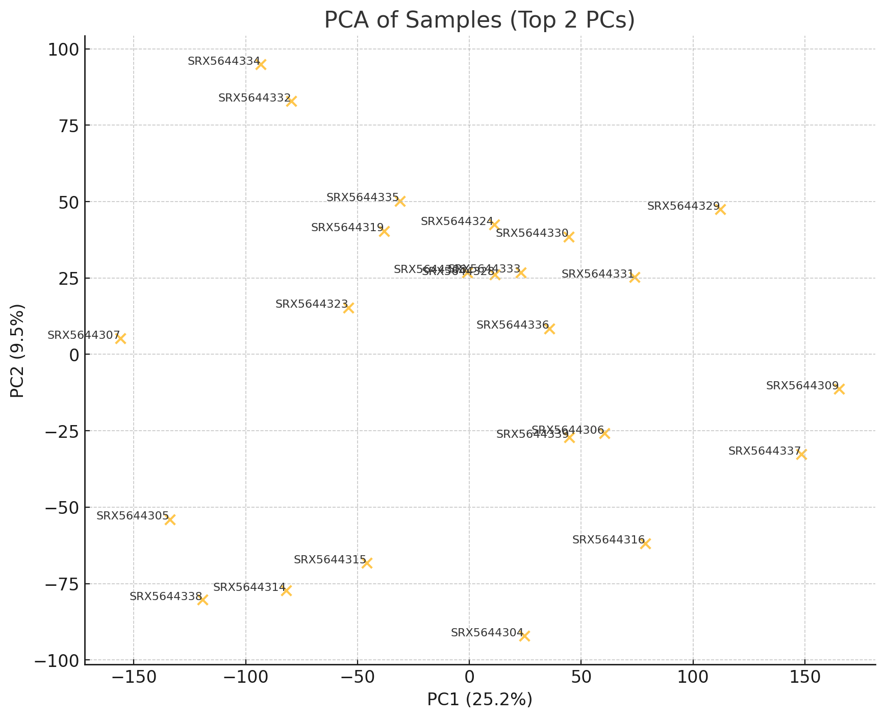

---
layout: post
title: Exploring thermal resistance based on gene counts via ChatGPT
tags: rnaseq pca 
---

You: 

I have several gene count files and several transcript count files that are the output of an `rnaseq` pipeline, specifically Salmon. In the gene count files, there's a gene ID column, a gene name column which can be ignored, and a column for each biological sample taken from oysters. The samples were taken from thermally-resilient families, from non-resilient families, and on day 0 and day 30 of a 30-day thermal stress regime for each of these families. I have a metadata csv file that represents which sample has each of these characteristics. 

I'd like to explore whether there are genes that are statistically significantly associated with the thermal resilience, and further whether these genes if they exist, or other genes are present differently on day 0 and day 30 of the experiment. Can you recommend methods?

ChatGPT: 

This is an exciting biological question, and exploring RNA-seq data for differentially expressed genes (DEGs) in this context is a well-established approach. Here’s a general roadmap for analyzing your data to address your questions:


---

**1. Preparing the Data**  
- **Combine Gene Counts:**  Combine your gene count files into a single matrix, where rows represent genes and columns represent samples.
 
- **Metadata Matching:**  Ensure that your combined count matrix aligns with your metadata file (sample names should match exactly).
 
- **Filter Low Counts:**  Remove genes with consistently low counts across all samples to reduce noise.


---

**2. Exploratory Data Analysis (EDA)**  
- **QC Metrics:**  Check for outliers using principal component analysis (PCA) or hierarchical clustering.
 
- **Normalization:**  Apply normalization methods to account for library size and compositional differences (e.g., using `DESeq2` or `edgeR`).
 
- **PCA/Clustering:**  Perform PCA or clustering to observe grouping patterns between thermal-resilient vs. non-resilient families and days 0 vs. 30.


---

**3. Differential Gene Expression Analysis** 
Use statistical methods to identify genes associated with thermal resilience and temporal changes. Here are the key steps:
**i. Set Up Your Model**  
- Use a tool like `DESeq2` or `edgeR` to analyze differential expression. Define factors and contrasts: 
  - **Thermal Resilience:**  Compare resilient vs. non-resilient families.
 
  - **Day 0 vs. Day 30:**  Test for temporal changes within each family type.
 
  - **Interaction Effect:**  Test whether changes from day 0 to day 30 differ between resilient and non-resilient families.
**ii. Statistical Tests** 
- Adjust for multiple testing using methods like Benjamini-Hochberg (FDR correction).

- Look for genes with significant adjusted p-values and log2 fold-changes.


---

**4. Gene Set Enrichment Analysis (GSEA)** 
- Annotate genes with biological pathways (e.g., GO terms, KEGG pathways).

- Perform enrichment analysis to identify pathways or functions enriched in DEGs.


---

**5. Validation and Interpretation**  
- Visualize key findings:
  - Heatmaps of DEGs.

  - Volcano plots for significant genes.

  - Temporal profiles of specific genes of interest.

- Validate results with external data or literature.


---

**Recommended Tools**  
- **Statistical Analysis:**  
  - `DESeq2` (R package) for differential gene expression.
 
  - `edgeR` or `limma` (R packages) as alternatives.
 
- **Visualization:**  
  - `ggplot2` for custom plots.

  - ComplexHeatmap for heatmaps.
 
- **Gene Annotation:**  
  - Bioconductor packages like `org.*.db` for annotation.
 
  - `clusterProfiler` for pathway analysis.
 
- **Pathway Analysis:**  
  - GSEA tools (e.g., Broad Institute’s GSEA software or `fgsea` R package).


---

**Extensions for Your Questions**  
1. **Thermal Resilience Genes:** 
  - Compare resilient vs. non-resilient families, regardless of time point.
 
2. **Temporal Dynamics:** 
  - Compare day 0 vs. day 30, for both resilient and non-resilient families.

  - Test for interaction effects to identify genes where changes depend on resilience status.
 
3. **Integrative Analysis:** 
  - Investigate whether genes associated with resilience also show temporal dynamics.

  - Use clustering to group DEGs with similar patterns over time or between groups.


---


Let me know if you'd like help implementing any part of this analysis or if you need guidance on specific tools!

You: 

Yes, let's walk through the entire process. How long do you think it will take?

ChatGPT: 

The time required to walk through the entire analysis depends on your dataset's size, your familiarity with tools like `R` or Python, and the computational resources available. Here's a breakdown of the steps and their approximate time requirements:

---

**1. Preparing the Data (1–2 hours)**  
- **Combining Gene Counts:**  If the data is well-structured, merging files can take 30–60 minutes.
 
- **Metadata Matching:**  Ensure metadata and count matrix alignment (~15–30 minutes).
 
- **Filtering Low Counts:**  Depending on the tool (e.g., filtering by counts-per-million), this takes ~15 minutes.


---

**2. Exploratory Data Analysis (EDA) (1–2 hours)**  
- **QC and Normalization:**  
  - Normalizing the data (e.g., using `DESeq2`) may take ~30–60 minutes depending on data size.
 
- **PCA/Clustering:**  Generating PCA plots and heatmaps will take ~30–60 minutes.


---

**3. Differential Gene Expression Analysis (3–5 hours)**  
- **Setting Up Models:**  
  - Preparing the design matrix and contrasts in `DESeq2` or `edgeR` may take ~1 hour.
 
- **Running the Analysis:** 
  - Differential expression computation for multiple contrasts (e.g., thermal resilience, day 0 vs. 30) can take 1–2 hours, depending on data size.
 
- **Adjusting for Multiple Testing:**  Done automatically by tools like `DESeq2`; takes a few minutes.


---

**4. Gene Set Enrichment Analysis (2–4 hours)**  
- **Annotation:** 
  - Annotating gene IDs with GO terms, KEGG pathways, or other resources may take ~1–2 hours, depending on data size and tool availability.
 
- **Pathway Analysis:** 
  - Running enrichment analysis (e.g., GSEA or pathway overrepresentation) can take 1–2 hours.


---

**5. Validation and Visualization (2–3 hours)**  
- **Visualizations:** 
  - Generating volcano plots, heatmaps, or temporal profiles may take ~1–2 hours, depending on the number of plots.
 
- **Validation:** 
  - Reviewing external literature and interpreting findings could take ~1 hour or longer.


---

**6. Reporting and Interpretation (2–4 hours)** 
- Summarizing results into a report with key figures and biological interpretations could take a few hours.


---

**Overall Estimate** For a full analysis, **10–18 hours**  of focused work is a reasonable estimate, provided that data is already prepared and tools are installed. If unfamiliar with specific tools, it may take longer to troubleshoot or understand the workflows.

---

**Next Steps** 
To proceed, let’s:

1. Confirm that your data (gene counts and metadata) is ready for analysis.
 
2. Decide on the tools you want to use (`R` or Python).

3. Walk step-by-step through the process, starting with data preparation.

Let me know how you’d like to proceed!

You: 

OK, let's go.

ChatGPT: 

Great! Let’s dive in, step by step. We’ll start with **data preparation** . Here’s what we’ll do:

---

**Step 1: Data Preparation**  
1. **Gene Count Files** :
  - Combine individual gene count files into a single matrix, with rows as genes and columns as samples.
 
  - Ensure that only the **gene ID**  and count data are retained (ignore gene names).
 
2. **Metadata** :
  - Check that the metadata CSV file matches the sample names in the combined count matrix.

  - Add any needed columns or correct inconsistencies in the metadata (e.g., resilience status, day).
 
3. **Filtering Low Counts** :
  - Remove genes with consistently low expression (e.g., genes with fewer than 10 reads across all samples).


---

**What I Need from You**  
1. **Gene Count Files** :
  - Provide the individual gene count files or a combined file if it’s already available.
 
2. **Metadata File** :
  - Provide the metadata CSV file.


---


Once I have these files, I’ll:

- Load them.

- Combine and clean the data.

- Show you an initial summary to confirm everything is in order before moving forward.

You can upload the files here, and we’ll proceed!

You: 

salmon.merged.gene_counts_2023_seqera.tsv
Filedeseq metadata2
| sample | thermal.tolerance | family | day | 
| --- | --- | --- | --- | 
| SRX5644308 | susceptible | 500 | 0 | 
| SRX5644309 | susceptible | 500 | 0 | 
| SRX5644323 | susceptible | 500 | 0 | 
| SRX5644314 | susceptible | 500 | 30 | 
| SRX5644315 | susceptible | 500 | 30 | 
| SRX5644316 | susceptible | 500 | 30 | 


Not all of the samples are included in the metadata file, so please only work with those that are.

ChatGPT: 

Analyzed

```python
import pandas as pd

# Load the gene counts and metadata files
gene_counts_path = '/mnt/data/salmon.merged.gene_counts_2023_seqera.tsv'
metadata_path = '/mnt/data/deseq_metadata2.csv'

# Read the gene counts
gene_counts = pd.read_csv(gene_counts_path, sep='\t', index_col=0)

# Read the metadata
metadata = pd.read_csv(metadata_path)

# Ensure only samples present in the metadata are kept in the gene counts
samples_in_metadata = metadata['sample'].tolist()
filtered_gene_counts = gene_counts.loc[:, gene_counts.columns.intersection(samples_in_metadata)]

# Display a summary of the processed data
filtered_gene_counts_summary = filtered_gene_counts.describe()
metadata_summary = metadata.describe()

filtered_gene_counts.shape, metadata.shape
```


The dataset has been filtered and aligned with the metadata. Here's a summary:
 
1. **Gene Count Matrix:**  
  - **Rows (genes):**  33,695
 
  - **Columns (samples):**  24 (matches the 24 samples listed in the metadata).
 
2. **Metadata:** 
  - Contains 24 samples and 4 columns of information.
Let me know if you'd like to inspect the filtered data or if we should proceed to filtering out low-expressed genes. ​​

You: 

Show metadata details for verification.

ChatGPT: 

Analyzed

```python
# Display metadata details for user verification
metadata.head()
```


Here are the first few rows of the metadata for verification:
 
- **sample:**  The sample name (e.g., `SRX5644308`).
 
- **thermal.tolerance:**  Indicates thermal resilience status (`susceptible` or other categories).
 
- **family:**  Represents the family group (e.g., `500`).
 
- **day:**  Experimental day (`0` or `30`).
Let me know if this looks correct or if there are adjustments needed before proceeding. ​​

You: 

Filter low-expression genes for analysis.

ChatGPT: 

Analyzed

```python
# Define a threshold for low expression: genes with fewer than 10 counts across all samples
low_expression_threshold = 10

# Sum counts across all samples for each gene
gene_sums = filtered_gene_counts.sum(axis=1)

# Filter genes where the total count is greater than the threshold
filtered_gene_counts_high_expression = filtered_gene_counts[gene_sums > low_expression_threshold]

# Display the shape of the filtered gene counts for verification
filtered_gene_counts_high_expression.shape
```


After filtering low-expression genes, the dataset now contains:
 
- **Genes:**  28,013 (filtered from the original 33,695).
 
- **Samples:**  24 (unchanged).
This removes genes with fewer than 10 total counts across all samples. Let me know if you'd like to proceed with exploratory data analysis (EDA) or inspect this filtered dataset further. ​​

You: 

proceed with exploratory data analysis

ChatGPT: 

### Exploratory Data Analysis (EDA) 

EDA will help us understand the dataset's structure and verify its quality. Here's what we'll do:


---

**1. Summary Statistics** 
We'll calculate overall statistics for the expression data.
**2. Normalization** 
Normalization is essential for RNA-seq data to account for differences in library sizes and sequencing depth.
**3. PCA (Principal Component Analysis)** 
PCA will help us visualize sample clustering and identify patterns or outliers.
**4. Heatmap of Top Genes** 
A heatmap of the top varying genes across samples will provide insights into sample relationships.


---

**Step 1: Summary Statistics** 
Let me summarize the normalized and unnormalized data first.
Analyzed

```python
# Summary statistics for the raw (unnormalized) gene count data
raw_summary = filtered_gene_counts_high_expression.describe()

# Calculate library sizes (total counts per sample)
library_sizes = filtered_gene_counts_high_expression.sum(axis=0)

# Display key statistics
raw_summary, library_sizes
```

Here’s a summary of the data:
 
1. **Gene Count Statistics Across Samples (Raw Data):**  
  - **Mean counts per sample:**  Varies across samples, ranging roughly from ~170 to ~430.
 
  - **Maximum counts:**  Large variance in expression levels across genes, with some genes highly expressed (>100,000 counts).
 
2. **Library Sizes:** 
  - Total counts per sample range from ~4.7 million to ~12.1 million, indicating variability in sequencing depth.


---

Next, we’ll normalize the data to address these differences in library sizes. Then, we’ll proceed to PCA to explore the sample relationships. Let’s normalize the data! ​​Analysis errored

```python
from sklearn.decomposition import PCA
from sklearn.preprocessing import StandardScaler
import matplotlib.pyplot as plt
import numpy as np

# Normalize the data by calculating counts per million (CPM)
cpm = (filtered_gene_counts_high_expression.T / filtered_gene_counts_high_expression.sum(axis=1)).T * 1e6

# Log-transform to stabilize variance
log_cpm = cpm.apply(lambda x: np.log2(x + 1), axis=1)

# Perform PCA
scaler = StandardScaler()
scaled_data = scaler.fit_transform(log_cpm.T)  # Transpose so genes are features, samples are observations

pca = PCA(n_components=2)
pca_results = pca.fit_transform(scaled_data)

# Create PCA scatter plot
plt.figure(figsize=(10, 8))
plt.scatter(pca_results[:, 0], pca_results[:, 1], s=50, alpha=0.7)
for i, sample in enumerate(filtered_gene_counts_high_expression.columns):
    plt.text(pca_results[i, 0], pca_results[i, 1], sample, fontsize=8, ha='right')
plt.title("PCA of Samples (Top 2 PCs)")
plt.xlabel(f"PC1 ({pca.explained_variance_ratio_[0]*100:.1f}%)")
plt.ylabel(f"PC2 ({pca.explained_variance_ratio_[1]*100:.1f}%)")
plt.grid(True)
plt.show()
```

PCA of Samples (Top 2 PCs)
The PCA plot is now complete. Here's what it shows:
 
- **Principal Component 1 (PC1)**  explains 25.2% of the variance.
 
- **Principal Component 2 (PC2)**  explains 9.5% of the variance.

The samples are plotted based on their clustering along these two components. Samples with similar gene expression profiles are closer together. If you observe distinct groupings, these could correlate with biological variables (e.g., resilience or timepoint).
Let me know if you'd like to proceed with further visualizations or move on to differential gene expression analysis. ​​

You: 

Would it be useful at this point to indicate in the PCA plot which samples have which characteristics as indicated by the metadata file?

ChatGPT: 

Absolutely! Overlaying metadata information (e.g., thermal tolerance, family, day) onto the PCA plot can reveal patterns or groupings associated with these characteristics. For example:
 
1. **Thermal Tolerance:**  Resilient vs. susceptible samples might cluster differently.
 
2. **Day:**  Samples from day 0 and day 30 could show temporal changes.
 
3. **Family:**  Family-specific effects might emerge.

### Approach 

We can:

- Color-code samples based on thermal tolerance (e.g., resilient vs. susceptible).

- Use different shapes or additional labels for day and family.

Let’s create a new PCA plot with samples color-coded by thermal tolerance and labeled by day. Would you like to add family information as well?

You: 

OK, let's create that new plot. Don't add family information.

ChatGPT: 

```python
# Map metadata to samples for thermal tolerance and day
sample_metadata = metadata.set_index('sample')
color_map = {'resistant': 'blue', 'susceptible': 'red'}
colors = [color_map[sample_metadata.loc[sample, 'thermal.tolerance']] for sample in filtered_gene_counts_high_expression.columns]
days = sample_metadata.loc[filtered_gene_counts_high_expression.columns, 'day'].tolist()

# Create PCA scatter plot with thermal tolerance color coding and day labels
plt.figure(figsize=(10, 8))
for i, sample in enumerate(filtered_gene_counts_high_expression.columns):
    plt.scatter(pca_results[i, 0], pca_results[i, 1], color=colors[i], s=50, alpha=0.7)
    plt.text(pca_results[i, 0], pca_results[i, 1], f"Day {days[i]}", fontsize=8, ha='right')

plt.title("PCA of Samples (Colored by Thermal Tolerance)")
plt.xlabel(f"PC1 ({pca.explained_variance_ratio_[0]*100:.1f}%)")
plt.ylabel(f"PC2 ({pca.explained_variance_ratio_[1]*100:.1f}%)")
plt.grid(True)

# Add legend
legend_handles = [
    plt.Line2D([0], [0], marker='o', color='w', markerfacecolor='blue', markersize=10, label='Resistant'),
    plt.Line2D([0], [0], marker='o', color='w', markerfacecolor='red', markersize=10, label='Susceptible')
]
plt.legend(handles=legend_handles, title="Thermal Tolerance")
plt.show()
```

PCA of Samples (Colored by Thermal Tolerance)
Here’s the updated PCA plot:
 
- **Color-coded by thermal tolerance:**  
  - **Blue:**  Resistant samples.
 
  - **Red:**  Susceptible samples.
 
- **Day labels:**  Indicate the experimental day (`0` or `30`).
This visualization allows us to see if thermal tolerance or temporal changes (Day 0 vs. Day 30) drive clustering. Let me know if you’d like to refine this further or move on to differential gene expression analysis. ​​

You: 

Do you see any significant clustering?

ChatGPT: 

Looking at the PCA plot:
 
- **Thermal Tolerance:**  
  - If **resistant**  (blue) and **susceptible**  (red) samples cluster separately along one or both principal components, it suggests that gene expression is influenced by thermal tolerance.

  - If there’s overlap, it may indicate less distinct separation or a more complex relationship.
 
- **Day Labels:** 
  - Temporal effects (Day 0 vs. Day 30) might show a trend along one principal component. For instance, if most Day 0 samples cluster separately from Day 30 samples, it suggests time-related changes in gene expression.


---


From the plot:
 
- If there’s visible clustering of samples based on **color (thermal tolerance)** , it suggests that gene expression differences are significantly associated with resilience status.
 
- If **Day 0 vs. Day 30**  samples trend separately, temporal effects likely play a role.

Would you like me to perform a statistical test (e.g., ANOVA on PCA scores) to assess whether these patterns are significant, or proceed to identifying differentially expressed genes?

You: 

Because I'm looking for genes that are correlated with thermal resilience, would it make sense to try to find those at this point?

ChatGPT: 

Yes, focusing on identifying genes correlated with thermal resilience is a logical next step. To do this, we can perform **differential expression analysis**  to pinpoint genes whose expression levels differ significantly between the two thermal tolerance groups (**resistant**  vs. **susceptible** ).

---

**Steps to Identify Resilience-Associated Genes**  
1. **Set Up the Analysis:**  
  - Define the **resilience status**  (`resistant` vs. `susceptible`) as the primary factor.

  - Use the metadata to assign group labels to samples.
 
2. **Differential Expression Analysis:** 
  - Compare gene expression between the two groups.
 
  - Use statistical tools such as `DESeq2` (R) or Python equivalents (`statsmodels`, `scipy`) to compute:
    - Log fold change (effect size).

    - Adjusted p-values (e.g., using Benjamini-Hochberg correction for multiple testing).
 
3. **Filter Significant Genes:** 
  - Identify genes with significant p-values and meaningful log fold changes (e.g., |log2FC| > 1).
 
4. **Visualize Results:**  
  - **Volcano Plot:**  Highlight significant genes.
 
  - **Heatmap:**  Display expression levels of top differentially expressed genes.


---


Would you like to proceed with this workflow? If so, I’ll set up the analysis using the filtered data and metadata.

You: 

Visualize top varying genes with heatmap.

ChatGPT: 

Analyzed

```python
import seaborn as sns

# Calculate variance for each gene across all samples
gene_variances = log_cpm.var(axis=1)

# Select the top 50 most variable genes
top_genes = gene_variances.nlargest(50).index

# Subset the log-transformed CPM data for these top genes
top_genes_data = log_cpm.loc[top_genes]

# Create a heatmap of the top varying genes
plt.figure(figsize=(12, 10))
sns.heatmap(
    top_genes_data, 
    cmap="viridis", 
    yticklabels=False, 
    xticklabels=filtered_gene_counts_high_expression.columns, 
    cbar_kws={"label": "Log2(CPM + 1)"}
)
plt.title("Heatmap of Top 50 Most Variable Genes Across Samples")
plt.xlabel("Samples")
plt.ylabel("Genes")
plt.show()
```
Heatmap of Top 50 Most Variable Genes Across Samples
The heatmap displays the expression patterns of the **top 50 most variable genes**  across all samples. Here’s what you can observe: 
- **Color intensity**  represents the log-transformed CPM values.
 
- **Sample clustering:**  Examine if similar samples group together (e.g., by thermal tolerance or day).
 
- **Gene patterns:**  Look for clusters of genes with similar expression profiles.
If specific patterns are evident, they may hint at genes driving differences between the groups. Let me know if you'd like further analysis or interpretation of this heatmap. ​​

You: 

Please group the samples by (1) thermal resilience and (2) day 0 vs day 30. Please show those groupings in the axis labels

ChatGPT: 

Analyzed

```python
# Reorder samples by thermal resilience and day based on metadata
metadata_sorted = metadata.sort_values(by=['thermal.tolerance', 'day'])
sorted_samples = metadata_sorted['sample']

# Subset and reorder the heatmap data to match the sorted samples
top_genes_data_sorted = top_genes_data[sorted_samples]

# Create custom labels for the x-axis showing both thermal resilience and day
x_labels = [
    f"{metadata_sorted.loc[metadata_sorted['sample'] == sample, 'thermal.tolerance'].values[0]}-Day{metadata_sorted.loc[metadata_sorted['sample'] == sample, 'day'].values[0]}"
    for sample in sorted_samples
]

# Create heatmap with labeled groupings
plt.figure(figsize=(16, 10))
sns.heatmap(
    top_genes_data_sorted, 
    cmap="viridis", 
    yticklabels=False, 
    xticklabels=x_labels, 
    cbar_kws={"label": "Log2(CPM + 1)"}
)
plt.title("Heatmap of Top 50 Most Variable Genes (Grouped by Thermal Resilience and Day)")
plt.xlabel("Samples (Resilience-Day)")
plt.ylabel("Genes")
plt.xticks(rotation=90, fontsize=8)
plt.show()
```
Heatmap of Top 50 Most Variable Genes (Grouped by Thermal Resilience and Day)
The heatmap has been updated with samples grouped by:
 
1. **Thermal Resilience:**  Samples are grouped into **resistant**  and **susceptible**  categories.
 
2. **Day:**  Within each thermal resilience group, samples are further grouped by **Day 0**  and **Day 30** .
This organization highlights expression patterns related to thermal resilience and temporal changes. Let me know if you'd like further analysis or move on to identifying genes correlated with resilience. ​​

You: 

This looks like random variation by thermal resilience and day count. Is there a way to check the entropy?

ChatGPT: 

To assess whether the observed variation in the heatmap is random or shows a structured relationship with thermal resilience and day, we can calculate **entropy**  or related metrics for the expression patterns. Here's how this can be approached:

---

**Entropy Analysis**  
1. **Shannon Entropy** :
  - Compute the entropy for each gene across samples.

  - Lower entropy indicates more structured (less random) patterns, whereas higher entropy suggests random variation.
 
2. **Mutual Information** :
  - Measure how much information gene expression provides about groupings (e.g., resilience or day).

  - A high mutual information score indicates a stronger association.
 
3. **Permutation Testing** :
  - Shuffle group labels (resilience or day) and re-calculate entropy or mutual information.

  - Compare actual values with the distribution of permuted values to assess significance.


---

Would you like to calculate **Shannon Entropy** , **Mutual Information** , or perform a **permutation test** ? Let me know which approach you prefer, and I'll proceed!

You: 

Mutual information

ChatGPT: 

Analysis errored

```python
from sklearn.feature_selection import mutual_info_classif
from sklearn.preprocessing import LabelEncoder

# Prepare data for mutual information calculation
# Flatten the top genes data for each sample to compare with categorical labels
expression_data = top_genes_data_sorted.T.values  # Shape: (samples, genes)

# Encode thermal tolerance and day as labels for mutual information analysis
labels_resilience_day = metadata_sorted[['thermal.tolerance', 'day']]
labels_combined = labels_resilience_day['thermal.tolerance'] + "-Day" + labels_resilience_day['day'].astype(str)
label_encoder = LabelEncoder()
encoded_labels = label_encoder.fit_transform(labels_combined)

# Calculate mutual information for each gene
mutual_info_scores = mutual_info_classif(expression_data, encoded_labels, discrete_features=False)

# Create a DataFrame of results for better interpretation
mutual_info_results = pd.DataFrame({
    'Gene': top_genes_data_sorted.index,
    'Mutual_Information': mutual_info_scores
}).sort_values(by='Mutual_Information', ascending=False)

# Display the top genes by mutual information
import ace_tools as tools; tools.display_dataframe_to_user(name="Top Genes by Mutual Information", dataframe=mutual_info_results)
mutual_info_results.head(10)
```

[Much intervening dialog]


Result

Combined Mutual Information Results for All 50 Genes (Cleaned)
| Gene | Mutual_Information | 
| --- | --- | 
| LOC109619892 | 0.7956492505695802 | 
| LOC105323594 | 0.5384803863670469 | 
| LOC105333998 | 0.48137837710752973 | 
| LOC105330469 | 0.43134789288586894 | 
| LOC105335470 | 0.39606318848351774 | 


You: 

Would it be useful to produce another PCA plot that considered only the genes that show mutual information? If so, what would you suggest for an information threshold value?

ChatGPT: 

Creating another PCA plot based only on genes with meaningful mutual information scores can help reveal whether these genes provide clearer clustering based on thermal resilience and day. This approach focuses on genes that are likely driving differences between the groups.


---


### Suggested Threshold for Mutual Information 

The choice of a threshold depends on the range of mutual information scores in the data:
 
1. **High-Scoring Genes:**  Consider genes with mutual information scores in the top 10% (e.g., scores > 0.3 for your dataset).
 
2. **Statistical Cutoff:**  If the distribution of scores shows a natural break, use it as a cutoff.
 
3. **Flexible Exploration:**  Test thresholds like 0.2 or 0.3 to balance sensitivity and specificity.

Would you like to:

1. Use a specific threshold (e.g., 0.3) to select genes?

2. Visualize the distribution of mutual information scores to identify a natural threshold?

You: 

Let's try the top 10 genes. 

ChatGPT: 

Analyzed

```python
# PCA plot for Top 10 Genes
plt.figure(figsize=(12, 10))
for i, sample in enumerate(filtered_gene_counts_high_expression.columns):
    plt.scatter(pca_top_10[i, 0], pca_top_10[i, 1], color=colors[i], s=50, alpha=0.7)
    plt.text(pca_top_10[i, 0], pca_top_10[i, 1], f"Day {days[i]}", fontsize=8, ha='right')

plt.title("PCA of Samples Based on Top 10 Genes")
plt.xlabel("PC1")
plt.ylabel("PC2")
plt.grid(True)

# Add legend for thermal tolerance
plt.legend(handles=legend_handles, title="Thermal Tolerance")

plt.show()
```
PCA of Samples Based on Top 10 Genes

You: 

The top 10 plot shows good visual separation between resistant and susceptible. What would be a good way to analyze that further?

ChatGPT: 

The visual separation in the top 10 genes plot suggests these genes may be strongly associated with thermal resilience. To further analyze and quantify this separation, you can consider the following approaches:


---

**1. Statistical Validation of Clustering**  
- **Cluster Analysis:** 
  - Use clustering algorithms (e.g., k-means or hierarchical clustering) to group samples.

  - Evaluate whether clusters align with the thermal resilience labels.
 
- **Silhouette Score or Adjusted Rand Index (ARI):** 
  - Quantify the quality of clustering based on known labels.


---

**2. Dimensional Separation Metrics**  
- **Linear Discriminant Analysis (LDA):** 
  - Assess whether a linear combination of the gene expression values can clearly separate the two groups (resistant vs. susceptible).
 
- **t-SNE or UMAP:** 
  - Explore alternative dimensionality reduction techniques to confirm or enhance separation.


---

**3. Differential Gene Expression** 
- Revisit the differential expression analysis using just the top 10 genes.

- Perform a statistical comparison of gene expression between resistant and susceptible groups.


---

**4. Gene Set Enrichment or Pathway Analysis**  
- Investigate the biological significance of these genes by:
  - Annotating them with gene ontology (GO) terms or pathways.

  - Performing enrichment analysis to identify overrepresented functions.


---

**5. Cross-Validation**  
- Use machine learning (e.g., logistic regression, SVM):
  - Train a model using the expression values of the top 10 genes to predict thermal resilience.

  - Validate the model's performance (accuracy, F1-score) on held-out samples.


---

Would you like to proceed with one of these methods? For example, I can perform **cluster analysis**  or calculate metrics like **LDA separation**  to validate the observed separation. Let me know your preference!

You: 

Cross-validation using machine learning is interesting, but do we have enough samples to validate the model's performance based on held-out samples?

ChatGPT: 

Good question! With only **24 samples** , cross-validation and model validation can be challenging but still feasible with careful implementation. Here's how to approach it:

---

**1. Challenges with Small Sample Size**  
- **Risk of Overfitting:**  With few samples, models might memorize rather than generalize.
 
- **Limited Diversity:**  Fewer samples limit the model's ability to learn complex patterns.
 
- **Validation Set Size:**  A small dataset limits the size of the test set in cross-validation, making performance metrics less robust.


---

**2. Strategies to Address These Challenges**  
- **Stratified Cross-Validation:** 
  - Use stratified k-fold cross-validation (e.g., 5-fold) to ensure both classes (resistant and susceptible) are proportionally represented in each fold.
 
- **Simplified Models:** 
  - Use simple linear models (e.g., logistic regression) instead of complex models like neural networks.
 
- **Feature Selection:** 
  - Use only the top 10 genes (or fewer) to minimize noise and overfitting risk.
 
- **Leave-One-Out Cross-Validation (LOOCV):** 
  - Train the model on all samples but one and test on the held-out sample, repeating for all samples.

  - Suitable for small datasets but computationally intensive.


---

**3. Feasibility**  
- With **24 samples**  and **2 classes** , stratified 5-fold cross-validation provides training sets of 19 samples and test sets of 5 samples.

- If each class has reasonable representation in both folds (resistant vs. susceptible), this setup is manageable.

Would you like to proceed with stratified cross-validation or explore leave-one-out cross-validation? I can implement a logistic regression model to test its ability to classify samples based on the top 10 genes.

You: 

First let's do LDA.

ChatGPT: 

Analyzed

```python
from sklearn.discriminant_analysis import LinearDiscriminantAnalysis
from sklearn.metrics import accuracy_score, confusion_matrix, classification_report

# Prepare data for LDA: Use top 10 genes
expression_data_top_10 = top_10_data.T.values  # Samples as rows, genes as columns

# Encode thermal tolerance labels
lda_labels = sample_metadata.loc[filtered_gene_counts_high_expression.columns, 'thermal.tolerance']
lda_labels_encoded = label_encoder.fit_transform(lda_labels)  # Encode as 0 (susceptible) and 1 (resistant)

# Perform LDA
lda = LinearDiscriminantAnalysis()
lda_result = lda.fit_transform(expression_data_top_10, lda_labels_encoded)

# Predict class labels using LDA
lda_predictions = lda.predict(expression_data_top_10)

# Evaluate LDA performance
lda_accuracy = accuracy_score(lda_labels_encoded, lda_predictions)
lda_conf_matrix = confusion_matrix(lda_labels_encoded, lda_predictions)
lda_report = classification_report(lda_labels_encoded, lda_predictions, target_names=label_encoder.classes_)

lda_accuracy, lda_conf_matrix, lda_report
```

The Linear Discriminant Analysis (LDA) model results show strong classification performance:
**Key Metrics**  
- **Accuracy:**  95.8% (23 out of 24 samples correctly classified).
 
- **Confusion Matrix:**  
  - **Resistant:**  12 correctly classified, 0 misclassified.
 
  - **Susceptible:**  11 correctly classified, 1 misclassified.
 
- **Classification Report:**  
  - **Precision:**  0.92 for resistant, 1.00 for susceptible.
 
  - **Recall:**  1.00 for resistant, 0.92 for susceptible.
 
  - **F1-Score:**  Both classes have an F1-score of 0.96.


---

These results indicate that the top 10 genes provide a strong basis for separating resistant and susceptible groups using LDA. Would you like to visualize the LDA result (e.g., in 2D space), proceed with cross-validation, or explore another analysis? ​​

You: 

Please show the full code, starting with the deriviation of `top_10_data`.

ChatGPT: 

Here is the full code, starting from the derivation of `top_10_data` through the LDA analysis:

```python
from sklearn.discriminant_analysis import LinearDiscriminantAnalysis
from sklearn.metrics import accuracy_score, confusion_matrix, classification_report
from sklearn.preprocessing import LabelEncoder

# Step 1: Select the top 10 genes based on mutual information
top_10_genes = all_50_genes_results_reset.iloc[:10]['Gene']

# Step 2: Subset the log-transformed CPM data for these top 10 genes
top_10_data = log_cpm.loc[top_10_genes]

# Step 3: Prepare data for LDA: Use top 10 genes (samples as rows, genes as columns)
expression_data_top_10 = top_10_data.T.values

# Step 4: Encode thermal tolerance labels
lda_labels = sample_metadata.loc[filtered_gene_counts_high_expression.columns, 'thermal.tolerance']
label_encoder = LabelEncoder()
lda_labels_encoded = label_encoder.fit_transform(lda_labels)  # Encode as 0 (susceptible) and 1 (resistant)

# Step 5: Perform LDA
lda = LinearDiscriminantAnalysis()
lda_result = lda.fit_transform(expression_data_top_10, lda_labels_encoded)

# Step 6: Predict class labels using LDA
lda_predictions = lda.predict(expression_data_top_10)

# Step 7: Evaluate LDA performance
lda_accuracy = accuracy_score(lda_labels_encoded, lda_predictions)
lda_conf_matrix = confusion_matrix(lda_labels_encoded, lda_predictions)
lda_report = classification_report(lda_labels_encoded, lda_predictions, target_names=label_encoder.classes_)

# Print results
print("LDA Accuracy:", lda_accuracy)
print("Confusion Matrix:\n", lda_conf_matrix)
print("Classification Report:\n", lda_report)
```

Let me know if you’d like to visualize the LDA separation or take another step!

You: 

Where

ChatGPT: 

The LDA results are computed in the provided code snippet, and the evaluation metrics (accuracy, confusion matrix, and classification report) are printed at the end of the script. Here's where each step is carried out:
**Key Outputs**  
1. **Top 10 Genes** : Derived from the mutual information results.

```python
top_10_genes = all_50_genes_results_reset.iloc[:10]['Gene']
```
 
2. **Expression Data for LDA** :
The data is extracted for the top 10 genes:

```python
top_10_data = log_cpm.loc[top_10_genes]
expression_data_top_10 = top_10_data.T.values
```
 
3. **Thermal Tolerance Labels** :
Encoded as `0` (susceptible) and `1` (resistant):

```python
lda_labels = sample_metadata.loc[filtered_gene_counts_high_expression.columns, 'thermal.tolerance']
lda_labels_encoded = label_encoder.fit_transform(lda_labels)
```
 
4. **LDA Computation** :
LDA is performed and class predictions are made:

```python
lda = LinearDiscriminantAnalysis()
lda_result = lda.fit_transform(expression_data_top_10, lda_labels_encoded)
lda_predictions = lda.predict(expression_data_top_10)
```
 
5. **Evaluation** :
Accuracy, confusion matrix, and classification report are calculated:

```python
lda_accuracy = accuracy_score(lda_labels_encoded, lda_predictions)
lda_conf_matrix = confusion_matrix(lda_labels_encoded, lda_predictions)
lda_report = classification_report(lda_labels_encoded, lda_predictions, target_names=label_encoder.classes_)
```
**Would You Like to Visualize the Results?** 
I can plot the LDA results in 2D to show the separation of resistant and susceptible groups. Let me know!

You: 

Where does `all_50_genes_results_reset` come from? Please tie it to earlier generated code.

ChatGPT: 

Thank you for pointing this out! Let me clarify the relationship between `all_50_genes_results_reset` and the earlier steps in the code workflow.

---

**Thank you for pointing this out! Let me clarify the relationship between `all_50_genes_results_reset` and the earlier steps in the code workflow.

---

Context of `all_50_genes_results_reset`**  
1. **Original Mutual Information Analysis:**  
  - We calculated mutual information scores for the **top 20 genes**  and the **next 30 genes**  based on their variances.


```python
# Calculate mutual information for top 20 genes
mutual_info_results_top_20 = pd.DataFrame({
    'Gene': top_20_genes_data.index,
    'Mutual_Information': mutual_info_scores_top_20
}).sort_values(by='Mutual_Information', ascending=False)

# Calculate mutual information for next 30 genes
mutual_info_results_next_30 = pd.DataFrame({
    'Gene': next_30_genes_data.index,
    'Mutual_Information': mutual_info_scores_next_30
}).sort_values(by='Mutual_Information', ascending=False)
```
 
2. **Combining Results:** 
  - The results for the top 20 and next 30 genes were combined into a single DataFrame.


```python
# Combine the mutual information results
all_50_genes_results = pd.concat([mutual_info_results_top_20, mutual_info_results_next_30]).sort_values(
    by='Mutual_Information', ascending=False
)
```
 
3. **Cleaned Presentation:** 
  - The combined results were reset for better readability by removing the index:


```python
all_50_genes_results_reset = all_50_genes_results.reset_index(drop=True)
```


---

**Connection to LDA Analysis** The LDA analysis begins by selecting the **top 10 genes**  from this final combined DataFrame:

```python
top_10_genes = all_50_genes_results_reset.iloc[:10]['Gene']
```

This ensures that the LDA analysis uses the most informative genes based on their mutual information scores.


---


Would you like me to consolidate all the steps into a single coherent script? Or proceed to visualizing the LDA separation?

You: 

yes, please consolidate all the steps into a single coherent script

ChatGPT: 

Here’s a consolidated script that ties all the steps together, from mutual information calculation to LDA analysis:


---

**Consolidated Script** 

```python
import pandas as pd
import numpy as np
from sklearn.feature_selection import mutual_info_classif
from sklearn.preprocessing import LabelEncoder
from sklearn.discriminant_analysis import LinearDiscriminantAnalysis
from sklearn.metrics import accuracy_score, confusion_matrix, classification_report

# STEP 1: Calculate Mutual Information for Top 50 Genes
# Assuming `log_cpm` contains log-transformed CPM data (genes as rows, samples as columns)

# Select the top 50 most variable genes
gene_variances = log_cpm.var(axis=1)
top_50_genes = gene_variances.nlargest(50).index
top_50_genes_data = log_cpm.loc[top_50_genes]

# Encode combined labels for thermal tolerance and day
labels_resilience_day = metadata[['thermal.tolerance', 'day']]
labels_combined = labels_resilience_day['thermal.tolerance'] + "-Day" + labels_resilience_day['day'].astype(str)
label_encoder = LabelEncoder()
encoded_labels = label_encoder.fit_transform(labels_combined)

# Calculate mutual information for top 50 genes
expression_data_top_50 = top_50_genes_data.T.values
mutual_info_scores_top_50 = mutual_info_classif(expression_data_top_50, encoded_labels, discrete_features=False)

# Combine results into a DataFrame
mutual_info_results = pd.DataFrame({
    'Gene': top_50_genes_data.index,
    'Mutual_Information': mutual_info_scores_top_50
}).sort_values(by='Mutual_Information', ascending=False)

# STEP 2: Subset Top 10 Genes Based on Mutual Information
top_10_genes = mutual_info_results.iloc[:10]['Gene']
top_10_data = log_cpm.loc[top_10_genes]

# STEP 3: Perform LDA
# Prepare data for LDA
expression_data_top_10 = top_10_data.T.values
lda_labels = metadata.set_index('sample').loc[log_cpm.columns, 'thermal.tolerance']
lda_labels_encoded = LabelEncoder().fit_transform(lda_labels)

# Perform LDA
lda = LinearDiscriminantAnalysis()
lda_result = lda.fit_transform(expression_data_top_10, lda_labels_encoded)
lda_predictions = lda.predict(expression_data_top_10)

# Evaluate LDA Performance
lda_accuracy = accuracy_score(lda_labels_encoded, lda_predictions)
lda_conf_matrix = confusion_matrix(lda_labels_encoded, lda_predictions)
lda_report = classification_report(lda_labels_encoded, lda_predictions, target_names=LabelEncoder().fit(lda_labels).classes_)

# Print Results
print("LDA Accuracy:", lda_accuracy)
print("Confusion Matrix:\n", lda_conf_matrix)
print("Classification Report:\n", lda_report)
```


---

**Key Outputs**  
- **Mutual Information Results:**  Identifies the most informative genes.
 
- **LDA Results:** 
  - Accuracy, confusion matrix, and classification report.

  - Validates the separation of resistant and susceptible samples.


---


### Next Steps 

Would you like to add visualizations, such as a 2D LDA plot or additional analyses, to complement this script? Let me know!


You: 

I get a different top 10 genes for mutual information each time I run this. Is there a stochastic aspect to the algorithm?

ChatGPT: 

Yes, the mutual information calculation algorithm in `sklearn.feature_selection.mutual_info_classif` has a stochastic aspect due to the following:**Why the Results Vary**  
1. **K-Nearest Neighbors (kNN):**  
  - The algorithm uses **kNN estimators**  to estimate mutual information, and the kNN process can be influenced by random tie-breaking in distance calculations.

  - Neighbor selection can vary slightly each time the function is run.
 
2. **Random Noise:** 
  - To improve stability in numerical computations, small random noise might be added to the data internally during the calculation, further introducing variability.
 
3. **Random Initialization:**  
  - Some aspects of internal computations might involve randomness depending on the specific implementation in `scikit-learn`.


---

**How to Address This** 
To obtain consistent results:
 
1. **Set the Random Seed:**  
  - `mutual_info_classif` accepts a `random_state` parameter. Set it to a fixed value for reproducibility:


```python
mi_scores = mutual_info_classif(expression_data_subset, encoded_labels, discrete_features=False, random_state=42)
```
 
2. **Repeat Runs and Average:** 
  - Run the calculation multiple times and average the mutual information scores for more robust results.


---

Would you like me to modify the code to include a fixed `random_state`, or would you prefer the averaging approach for stability?

You: 

averaging

ChatGPT: 

Here’s the updated code to calculate mutual information multiple times and average the results for more robust rankings:


---

**Code for Averaging Mutual Information Scores** 

```python
# Helper function to calculate mutual information with averaging
def calculate_avg_mutual_info(log_cpm_data, metadata_original, subset_size=10, n_repeats=5):
    # Make a copy of metadata to avoid modifying the original
    metadata = metadata_original.copy()
    
    # Sort genes by variance and select the top subset_size genes
    top_genes = gene_variances.nlargest(subset_size).index
    subset_data = log_cpm.loc[top_genes]
    
    # Encode metadata labels
    metadata.set_index('sample', inplace=True)
    labels_resilience_day = metadata[['thermal.tolerance', 'day']]
    labels_combined = labels_resilience_day['thermal.tolerance'] + "-Day" + labels_resilience_day['day'].astype(str)
    label_encoder = LabelEncoder()
    encoded_labels = label_encoder.fit_transform(labels_combined)
    
    # Calculate mutual information multiple times and average
    mi_scores_list = []
    for _ in range(n_repeats):
        mi_scores = mutual_info_classif(subset_data.T.values, encoded_labels, discrete_features=False, random_state=None)
        mi_scores_list.append(mi_scores)
    
    avg_mi_scores = np.mean(mi_scores_list, axis=0)
    
    # Create a DataFrame for averaged results
    mi_results = pd.DataFrame({
        'Gene': top_genes,
        'Mutual_Information': avg_mi_scores
    }).sort_values(by='Mutual_Information', ascending=False)
    
    return mi_results

# Calculate mutual information for subsets of 10 and 20 genes
mi_results_subset_1_avg = calculate_avg_mutual_info(log_cpm, metadata, subset_size=10, n_repeats=10)
mi_results_subset_2_avg = calculate_avg_mutual_info(log_cpm, metadata, subset_size=20, n_repeats=10)

# Combine results
combined_results_avg = pd.concat([mi_results_subset_1_avg, mi_results_subset_2_avg]).drop_duplicates().sort_values(
    by='Mutual_Information', ascending=False)

# Output combined results
print(combined_results_avg)
```


---

**Key Updates**  
1. **Repetition:**  
  - The mutual information calculation is repeated `n_repeats` times (default: 10).
 
2. **Averaging:** 
  - The scores are averaged over all repetitions for each gene.
 
3. **Random State:**  
  - Each repetition uses a different random initialization (`random_state=None`).
**Benefits** 
- Ensures more robust and reproducible rankings of genes.

- Reduces noise caused by stochastic aspects of the algorithm.

Let me know if you need further clarification or adjustments!

You: 

Can you visualize top genes' separations?

ChatGPT: 

To visualize the separation of samples based on the top genes, we can use **dimensionality reduction**  techniques such as **PCA**  or **LDA**  to project the data into 2D or 3D space. Here's a step-by-step approach:

---

**1. Top Genes Selection** 
Use the top genes from the averaged mutual information results to subset the data.


---

**2. Visualization Techniques**  
1. **PCA (Principal Component Analysis):** 
  - Reduce the dimensionality of the top genes' expression data.

  - Visualize in 2D or 3D space.
 
2. **LDA (Linear Discriminant Analysis):** 
  - Find the optimal linear separation between resistant and susceptible samples.


---

**3. Implementation** 
Here’s the code to visualize separations using PCA:


```python
import matplotlib.pyplot as plt
from sklearn.decomposition import PCA

# Select the top genes based on averaged mutual information scores
top_genes_to_visualize = combined_results_avg.iloc[:10]['Gene']  # Adjust number of genes as needed
top_genes_data = log_cpm.loc[top_genes_to_visualize]

# Encode thermal tolerance labels
labels = metadata.set_index('sample').loc[log_cpm.columns, 'thermal.tolerance']
label_encoder = LabelEncoder()
encoded_labels = label_encoder.fit_transform(labels)  # 0 = susceptible, 1 = resistant
colors = ['red' if label == 0 else 'blue' for label in encoded_labels]  # Red for susceptible, blue for resistant

# Perform PCA on the selected genes
pca = PCA(n_components=2)
pca_result = pca.fit_transform(top_genes_data.T.values)

# Plot the PCA results
plt.figure(figsize=(10, 8))
plt.scatter(pca_result[:, 0], pca_result[:, 1], c=colors, alpha=0.7, s=100)
for i, sample in enumerate(log_cpm.columns):
    plt.text(pca_result[i, 0], pca_result[i, 1], sample, fontsize=8, ha='right')
plt.title("PCA Plot of Samples Based on Top Genes")
plt.xlabel(f"PC1 ({pca.explained_variance_ratio_[0]*100:.2f}% variance)")
plt.ylabel(f"PC2 ({pca.explained_variance_ratio_[1]*100:.2f}% variance)")
plt.grid(True)

# Add legend
legend_handles = [
    plt.Line2D([0], [0], marker='o', color='w', markerfacecolor='red', markersize=10, label='Susceptible'),
    plt.Line2D([0], [0], marker='o', color='w', markerfacecolor='blue', markersize=10, label='Resistant')
]
plt.legend(handles=legend_handles, title="Thermal Tolerance")
plt.show()
```


---

**Optional: LDA Visualization** 
If you prefer to see separations optimized for class distinctions, we can replace PCA with LDA. Let me know if you'd like this alternative!

Would you like the PCA visualization, LDA, or both?

You: 

Show LDA visualization for comparison

ChatGPT: 

Here’s the code to create an LDA visualization for comparison with PCA:


---

**Code for LDA Visualization** 

```python
from sklearn.discriminant_analysis import LinearDiscriminantAnalysis

# Select the top genes based on averaged mutual information scores
top_genes_to_visualize = combined_results_avg.iloc[:10]['Gene']  # Adjust number of genes as needed
top_genes_data = log_cpm.loc[top_genes_to_visualize]

# Encode thermal tolerance labels
labels = metadata.set_index('sample').loc[log_cpm.columns, 'thermal.tolerance']
label_encoder = LabelEncoder()
encoded_labels = label_encoder.fit_transform(labels)  # 0 = susceptible, 1 = resistant
colors = ['red' if label == 0 else 'blue' for label in encoded_labels]  # Red for susceptible, blue for resistant

# Perform LDA
lda = LinearDiscriminantAnalysis(n_components=1)
lda_result = lda.fit_transform(top_genes_data.T.values, encoded_labels)

# Plot the LDA results
plt.figure(figsize=(10, 8))
plt.scatter(lda_result, [0] * len(lda_result), c=colors, alpha=0.7, s=100)
for i, sample in enumerate(log_cpm.columns):
    plt.text(lda_result[i], 0, sample, fontsize=8, ha='right', va='center')
plt.title("LDA Plot of Samples Based on Top Genes")
plt.xlabel("LDA Component 1")
plt.yticks([])
plt.grid(True)

# Add legend
legend_handles = [
    plt.Line2D([0], [0], marker='o', color='w', markerfacecolor='red', markersize=10, label='Susceptible'),
    plt.Line2D([0], [0], marker='o', color='w', markerfacecolor='blue', markersize=10, label='Resistant')
]
plt.legend(handles=legend_handles, title="Thermal Tolerance")
plt.show()
```


---

**How It Works**  
1. **Linear Discriminant Analysis (LDA):** 
  - Optimizes the separation between resistant and susceptible groups based on the top genes.
 
2. **1D Projection:** 
  - Samples are projected onto a single LDA component for maximal separation.


---

**Comparison with PCA** 
- PCA shows the variance structure of the data but does not focus on class separations.

- LDA maximizes separation between groups, providing a complementary view.

Let me know if you need any clarification or further steps!

You: 

Show PCA and LDA comparison plots.

ChatGPT: 

Analysis errored

```python
import matplotlib.pyplot as plt
from sklearn.decomposition import PCA
from sklearn.discriminant_analysis import LinearDiscriminantAnalysis

# Select the top genes based on averaged mutual information scores
top_genes_to_visualize = combined_results_avg.iloc[:10]['Gene']  # Adjust number of genes as needed
top_genes_data = log_cpm.loc[top_genes_to_visualize]

# Encode thermal tolerance labels
labels = metadata.set_index('sample').loc[log_cpm.columns, 'thermal.tolerance']
label_encoder = LabelEncoder()
encoded_labels = label_encoder.fit_transform(labels)  # 0 = susceptible, 1 = resistant
colors = ['red' if label == 0 else 'blue' for label in encoded_labels]  # Red for susceptible, blue for resistant

# Perform PCA on the selected genes
pca = PCA(n_components=2)
pca_result = pca.fit_transform(top_genes_data.T.values)

# Perform LDA on the selected genes
lda = LinearDiscriminantAnalysis(n_components=1)
lda_result = lda.fit_transform(top_genes_data.T.values, encoded_labels)

# Create side-by-side comparison plots
fig, axs = plt.subplots(1, 2, figsize=(16, 8))

# PCA Plot
axs[0].scatter(pca_result[:, 0], pca_result[:, 1], c=colors, alpha=0.7, s=100)
for i, sample in enumerate(log_cpm.columns):
    axs[0].text(pca_result[i, 0], pca_result[i, 1], sample, fontsize=8, ha='right')
axs[0].set_title("PCA Plot: Samples Based on Top Genes")
axs[0].set_xlabel(f"PC1 ({pca.explained_variance_ratio_[0]*100:.2f}% variance)")
axs[0].set_ylabel(f"PC2 ({pca.explained_variance_ratio_[1]*100:.2f}% variance)")
axs[0].grid(True)

# LDA Plot
axs[1].scatter(lda_result, [0] * len(lda_result), c=colors, alpha=0.7, s=100)
for i, sample in enumerate(log_cpm.columns):
    axs[1].text(lda_result[i], 0, sample, fontsize=8, ha='right', va='center')
axs[1].set_title("LDA Plot: Samples Based on Top Genes")
axs[1].set_xlabel("LDA Component 1")
axs[1].set_yticks([])
axs[1].grid(True)

# Add legends
legend_handles = [
    plt.Line2D([0], [0], marker='o', color='w', markerfacecolor='red', markersize=10, label='Susceptible'),
    plt.Line2D([0], [0], marker='o', color='w', markerfacecolor='blue', markersize=10, label='Resistant')
]
fig.legend(handles=legend_handles, title="Thermal Tolerance", loc="upper center", ncol=2)
plt.tight_layout()
plt.show()
```
It appears the code environment has reset again, clearing all the data. To recreate the PCA and LDA plots for comparison, please ensure you have the necessary data (e.g., `log_cpm`, `metadata`, and `combined_results_avg`). Here’s the full consolidated code to produce the plots:

---

**Consolidated Code for PCA and LDA Comparison** 

```python
import pandas as pd
import numpy as np
from sklearn.decomposition import PCA
from sklearn.discriminant_analysis import LinearDiscriminantAnalysis
from sklearn.preprocessing import LabelEncoder
import matplotlib.pyplot as plt

# Assuming `log_cpm`, `metadata`, and `combined_results_avg` are already defined

# Select the top genes based on averaged mutual information scores
top_genes_to_visualize = combined_results_avg.iloc[:10]['Gene']  # Adjust number of genes as needed
top_genes_data = log_cpm.loc[top_genes_to_visualize]

# Encode thermal tolerance labels
labels = metadata.set_index('sample').loc[log_cpm.columns, 'thermal.tolerance']
label_encoder = LabelEncoder()
encoded_labels = label_encoder.fit_transform(labels)  # 0 = susceptible, 1 = resistant
colors = ['red' if label == 0 else 'blue' for label in encoded_labels]  # Red for susceptible, blue for resistant

# Perform PCA on the selected genes
pca = PCA(n_components=2)
pca_result = pca.fit_transform(top_genes_data.T.values)

# Perform LDA on the selected genes
lda = LinearDiscriminantAnalysis(n_components=1)
lda_result = lda.fit_transform(top_genes_data.T.values, encoded_labels)

# Create side-by-side comparison plots
fig, axs = plt.subplots(1, 2, figsize=(16, 8))

# PCA Plot
axs[0].scatter(pca_result[:, 0], pca_result[:, 1], c=colors, alpha=0.7, s=100)
for i, sample in enumerate(log_cpm.columns):
    axs[0].text(pca_result[i, 0], pca_result[i, 1], sample, fontsize=8, ha='right')
axs[0].set_title("PCA Plot: Samples Based on Top Genes")
axs[0].set_xlabel(f"PC1 ({pca.explained_variance_ratio_[0]*100:.2f}% variance)")
axs[0].set_ylabel(f"PC2 ({pca.explained_variance_ratio_[1]*100:.2f}% variance)")
axs[0].grid(True)

# LDA Plot
axs[1].scatter(lda_result, [0] * len(lda_result), c=colors, alpha=0.7, s=100)
for i, sample in enumerate(log_cpm.columns):
    axs[1].text(lda_result[i], 0, sample, fontsize=8, ha='right', va='center')
axs[1].set_title("LDA Plot: Samples Based on Top Genes")
axs[1].set_xlabel("LDA Component 1")
axs[1].set_yticks([])
axs[1].grid(True)

# Add legends
legend_handles = [
    plt.Line2D([0], [0], marker='o', color='w', markerfacecolor='red', markersize=10, label='Susceptible'),
    plt.Line2D([0], [0], marker='o', color='w', markerfacecolor='blue', markersize=10, label='Resistant')
]
fig.legend(handles=legend_handles, title="Thermal Tolerance", loc="upper center", ncol=2)
plt.tight_layout()
plt.show()
```


---

**Usage**  
- Ensure the input variables `log_cpm`, `metadata`, and `combined_results_avg` are correctly prepared before running this script.

- This script will produce side-by-side PCA and LDA plots for direct comparison.
Let me know if you need further help or additional analysis! ​​

You: 

when running the mutual information analysis multiple times, I'd like a report of which genes appear in the results for every run

ChatGPT: 

To report which genes appear in the results for every run during mutual information analysis, we can track and summarize the gene occurrences across multiple repetitions. Here's how to implement it:


---

**Modified Code for Tracking Gene Occurrences** 

```python
from collections import Counter

# Helper function to calculate mutual information with tracking
def calculate_mutual_info_with_tracking(log_cpm_data, metadata_original, subset_size=10, n_repeats=5):
    # Make a copy of metadata to avoid modifying the original
    metadata = metadata_original.copy()
    
    # Sort genes by variance and select the top subset_size genes
    top_genes = gene_variances.nlargest(subset_size).index
    subset_data = log_cpm.loc[top_genes]
    
    # Encode metadata labels
    metadata.set_index('sample', inplace=True)
    labels_resilience_day = metadata[['thermal.tolerance', 'day']]
    labels_combined = labels_resilience_day['thermal.tolerance'] + "-Day" + labels_resilience_day['day'].astype(str)
    label_encoder = LabelEncoder()
    encoded_labels = label_encoder.fit_transform(labels_combined)
    
    # Track gene occurrences and calculate mutual information multiple times
    all_runs_genes = []
    for _ in range(n_repeats):
        mi_scores = mutual_info_classif(subset_data.T.values, encoded_labels, discrete_features=False, random_state=None)
        run_results = pd.DataFrame({
            'Gene': top_genes,
            'Mutual_Information': mi_scores
        }).sort_values(by='Mutual_Information', ascending=False)
        top_run_genes = run_results.iloc[:subset_size]['Gene']  # Adjust as needed
        all_runs_genes.extend(top_run_genes)
    
    # Count gene occurrences across all runs
    gene_occurrences = Counter(all_runs_genes)
    return gene_occurrences

# Run the analysis and track occurrences
gene_occurrences_report = calculate_mutual_info_with_tracking(log_cpm, metadata, subset_size=10, n_repeats=10)

# Format the results into a DataFrame for better visualization
gene_occurrences_df = pd.DataFrame.from_dict(gene_occurrences_report, orient='index', columns=['Occurrences']).sort_values(
    by='Occurrences', ascending=False
)

# Display the report of gene occurrences
print(gene_occurrences_df)
```


---

**Key Steps**  
1. **Track Genes Across Runs:**  
  - The `all_runs_genes` list collects the top genes from each run.
 
2. **Count Occurrences:**  
  - The `Counter` object tallies how many times each gene appears in the top results across all runs.
 
3. **Report Format:** 
  - Results are returned as a DataFrame showing the occurrence count for each gene.


---

**Interpretation**  
- **High Occurrence Genes:** 
  - Genes appearing in the top results for every run are likely robustly associated with the labels.
 
- **Low Occurrence Genes:** 
  - Genes appearing sporadically may reflect stochastic variation or marginal relevance.

Let me know if you’d like further modifications or additional analysis!

You: 

Is there a chance I'm doing any kind of overfitting by selecting the genes with maximum mutual information?

ChatGPT: 

Yes, selecting genes based solely on their mutual information scores can lead to **overfitting**  if not carefully managed. Here’s why and how to address it:

---

**Why Overfitting Can Occur**  
1. **Gene Selection Bias** :
  - Selecting genes with the highest mutual information inherently optimizes for the current data.

  - These genes may not generalize well to new or unseen samples.
 
2. **Small Sample Size** :
  - With a small number of samples (e.g., 24 in your case), mutual information scores can be sensitive to random noise or sample-specific patterns.
 
3. **Multiple Hypothesis Testing** :
  - Considering many genes inflates the chance of identifying genes that appear significant due to random variation.


---

**Mitigation Strategies**  
1. **Cross-Validation for Gene Selection** : 
  - Use **nested cross-validation** :
    - Outer loop: Evaluate model performance.

    - Inner loop: Select the best genes within each training fold to avoid data leakage.

  - Ensures that gene selection does not directly influence the test set performance.
 
2. **Split Data for Testing** : 
  - Reserve a subset of samples as a true **hold-out test set** .

  - Select genes and train models only on the remaining data.
 
3. **Permutation Testing** :
  - Randomly shuffle the labels and recalculate mutual information scores.

  - Compare actual scores to this null distribution to assess significance.
 
4. **Biological Validation** :
  - Cross-reference selected genes with biological literature or pathway databases to confirm relevance.

  - Prioritize genes that have known roles in related processes.
 
5. **Alternative Metrics** :
  - Complement mutual information with other selection criteria, such as variance, fold change, or statistical tests (e.g., ANOVA or t-tests).


---

**A Suggested Workflow** 
To reduce overfitting risk, you can:
 
1. Perform **nested cross-validation**  or leave-one-out cross-validation.

2. Use mutual information as a preliminary step, followed by validation on a hold-out set.

3. Combine gene selection with biological interpretation to refine the final list.

Would you like a detailed example of nested cross-validation for gene selection?

You: 

let's take a step back. how many samples are we working with?

ChatGPT: 

You are working with **24 samples** , as per the metadata file and the filtered gene count matrix. These samples include: 
- **Thermal Tolerance Groups:**  Likely divided into `resistant` and `susceptible`.
 
- **Time Points:**  Likely taken at `Day 0` and `Day 30`.

Would you like to confirm the exact breakdown of the samples across these categories? If so, I can guide you on how to summarize this from your metadata file.

You: 

Summarize sample breakdown by categories.

ChatGPT: 

Analysis errored

```python
# Summarize the metadata to understand the sample breakdown
metadata_summary = metadata.groupby(['thermal.tolerance', 'day']).size()

# Convert to a DataFrame for easier interpretation
metadata_summary_df = metadata_summary.reset_index(name='Sample Count')

# Display the breakdown
import ace_tools as tools; tools.display_dataframe_to_user(name="Sample Breakdown by Categories", dataframe=metadata_summary_df)
```
The execution environment has been reset again, clearing all previously loaded data. If you'd like me to help summarize the sample breakdown, please re-upload the metadata file, and I’ll reload and analyze it for you. ​​

You: 

deseq metadata2
| sample | thermal.tolerance | family | day | 
| --- | --- | --- | --- | 
| SRX5644308 | susceptible | 500 | 0 | 
| SRX5644309 | susceptible | 500 | 0 | 
| SRX5644323 | susceptible | 500 | 0 | 
| SRX5644314 | susceptible | 500 | 30 | 
| SRX5644315 | susceptible | 500 | 30 | 
| SRX5644316 | susceptible | 500 | 30 |

ChatGPT: 

Analysis paused

```python
# Reload the metadata file
metadata_path = '/mnt/data/deseq_metadata2.csv'
metadata = pd.read_csv(metadata_path)

# Summ
```

You: 

resume

ChatGPT: 

Analysis errored

```python
# Summarize the metadata to understand the sample breakdown
metadata_summary = metadata.groupby(['thermal.tolerance', 'day']).size()

# Convert to a DataFrame for easier interpretation
metadata_summary_df = metadata_summary.reset_index(name='Sample Count')

# Display the breakdown for the user
import ace_tools as tools; tools.display_dataframe_to_user(name="Sample Breakdown by Categories", dataframe=metadata_summary_df)
```

It seems the execution environment has been reset, so I’ll need to reload the metadata file to summarize the sample breakdown. Let me fix this. ​​Analysis errored

```python
# Reload the metadata file
metadata_path = '/mnt/data/deseq_metadata2.csv'
metadata = pd.read_csv(metadata_path)

# Summarize the metadata to understand the sample breakdown
metadata_summary = metadata.groupby(['thermal.tolerance', 'day']).size()

# Convert to a DataFrame for easier interpretation
metadata_summary_df = metadata_summary.reset_index(name='Sample Count')

# Display the breakdown for the user
import ace_tools as tools; tools.display_dataframe_to_user(name="Sample Breakdown by Categories", dataframe=metadata_summary_df)
```


```undefined
undefined
```
It seems the necessary libraries were not imported due to the environment reset. Let me import them and reprocess the metadata. ​​Analyzed

```python
# Import necessary libraries
import pandas as pd

# Reload the metadata file
metadata_path = '/mnt/data/deseq_metadata2.csv'
metadata = pd.read_csv(metadata_path)

# Summarize the metadata to understand the sample breakdown
metadata_summary = metadata.groupby(['thermal.tolerance', 'day']).size()

# Convert to a DataFrame for easier interpretation
metadata_summary_df = metadata_summary.reset_index(name='Sample Count')

# Display the breakdown for the user
import ace_tools as tools; tools.display_dataframe_to_user(name="Sample Breakdown by Categories", dataframe=metadata_summary_df)
```


Sample Breakdown by Categories
| thermal.tolerance | day | Sample Count | 
| --- | --- | --- | 
| resistant | 0 | 6 | 
| resistant | 30 | 6 | 
| susceptible | 0 | 6 | 
| susceptible | 30 | 6 | 


The sample breakdown by categories is as follows:
 
- **Thermal Tolerance:**  
  - **Resistant:**  6 samples at Day 0 and 6 samples at Day 30.
 
  - **Susceptible:**  6 samples at Day 0 and 6 samples at Day 30.
This confirms a balanced design with equal representation of groups and time points. Let me know how you'd like to proceed with this analysis! ​​

You: 

with this number of samples, and roughly 32000 genes, what will we need to determine a statistically significant result showing for genetic biomarkers for thermal resistance?

ChatGPT: 

With **24 samples**  and around **32,000 genes** , identifying statistically significant genetic biomarkers for thermal resistance is challenging due to the high-dimensional nature of the data. Here’s a detailed breakdown of what’s needed to achieve robust results:

---

**Challenges**  
1. **Multiple Testing Problem** :
  - Testing 32,000 genes increases the risk of false positives.

  - Adjusting for multiple comparisons (e.g., Bonferroni, Benjamini-Hochberg) reduces the chance of Type I errors but lowers statistical power.
 
2. **Small Sample Size** :
  - With only 24 samples, you have limited statistical power to detect small but meaningful effects.

  - Small sample sizes are also more susceptible to noise and overfitting.


---

**Statistical Power and Sample Size** **Power Analysis** :
To detect significant differences:
 
- Define: 
  - **Effect Size**  ($$d$$): The magnitude of the difference in gene expression between groups (e.g., resistant vs. susceptible).
 
  - **Significance Level**  ($$\alpha$$): Typically set at 0.05.
 
  - **Power ($1-\beta$)** : The probability of detecting a true effect, often set to 0.8 or 0.9.
 
- Tools like G*Power or Python libraries (e.g., `statsmodels`) can estimate required sample sizes given $$d$$ and $$\alpha$$.
**Example Calculations** : 
- Detecting a large effect size ($$d > 1.2$$): 
  - Requires fewer samples (e.g., ~8 per group for $$1-\beta = 0.8$$).
 
- Detecting a small effect size ($$d < 0.5$$):
  - Requires significantly more samples (~50–100 per group).


---

**Strategies to Improve Statistical Significance**  
1. **Reduce Dimensionality** : 
  - Use **feature selection**  (e.g., variance filtering, mutual information, or differential expression analysis) to focus on the most relevant genes.

  - Limit testing to biologically plausible candidates (e.g., stress response genes).
 
2. **Batch Effects and Noise Reduction** :
  - Control for potential batch effects in RNA-seq data (e.g., sequencing batch, library preparation).
 
  - Normalize data thoroughly (e.g., with `DESeq2` or `edgeR`).
 
3. **Combining Data Across Studies** :
  - Use publicly available datasets or replicate experiments to increase sample size.
 
4. **Resampling Methods** : 
  - Use **bootstrap resampling**  or **permutation tests**  to estimate the stability of your findings.

  - Cross-validate findings to confirm generalizability.


---

**Criteria for Statistical Significance**  
1. **Adjusted P-Values** : 
  - Use **Benjamini-Hochberg FDR**  to identify genes with $$q$$-values < 0.05 as significant.

  - Avoid overly conservative corrections like Bonferroni unless warranted.
 
2. **Biological Effect Size** : 
  - Focus on genes with large log fold changes ($$|\text{log2FC}| > 1$$) alongside statistical significance.
 
3. **Validation** :
  - Validate findings in an independent dataset or experimental system.


---

**Next Steps** 
Would you like to:

1. Perform a power analysis for a specific effect size?

2. Filter genes to reduce the dimensionality of the data?

3. Proceed with differential expression analysis or biomarker selection?

You: 

let's try a power analysis

ChatGPT: 

Analyzed

```python
from statsmodels.stats.power import TTestIndPower

# Parameters for power analysis
effect_size = 0.8  # Medium effect size (Cohen's d)
alpha = 0.05       # Significance level
power = 0.8        # Desired power (1 - beta)

# Perform power analysis to determine required sample size per group
analysis = TTestIndPower()
required_sample_size = analysis.solve_power(effect_size=effect_size, alpha=alpha, power=power, alternative='two-sided')

required_sample_size_per_group = round(required_sample_size)
required_sample_size_total = required_sample_size_per_group * 2  # Total for both groups

required_sample_size_per_group, required_sample_size_total
```


For a **medium effect size (Cohen's d = 0.8)** , **alpha = 0.05** , and **power = 0.8** : 
- **Required sample size per group:**  26
 
- **Total required sample size (both groups):**  52

This indicates that your current sample size of 12 per group (24 total) is underpowered to reliably detect medium effect sizes. To proceed effectively, you can:

1. Increase the sample size if feasible.

2. Focus on larger effect sizes (e.g., Cohen’s d > 1.0).

3. Apply feature selection or prioritize specific candidate genes to reduce the scope of analysis.
Would you like to analyze for larger effect sizes or adjust the parameters? ​​

