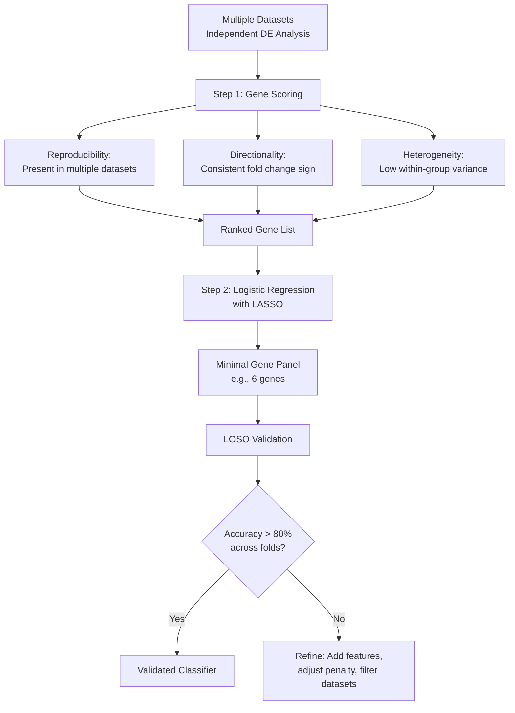

# Pipeline: Two-Step Classifier

## Overview

The two-step classifier approach identifies a minimal gene panel that distinguishes tolerant from sensitive phenotypes through:

1. **Step 1:** Rank genes based on reproducibility, directionality consistency, and heterogeneity across datasets
2. **Step 2:** Use logistic regression to find the minimum gene set that achieves good classification

**Status:** ✅ **Validated** - Produced the working 6-gene classifier panel

## When to Use This Approach

✅ **Use when:**

- You want a minimal gene panel for practical application (< 10 genes)
- You have multiple independent datasets to assess reproducibility
- You need cross-study validation (LOSO)
- You don't want to exclude innate biomarkers (constitutively different)

✅ **Advantages over stepwise:**

- Doesn't require control groups
- Preserves innate biomarkers
- Reproducibility-focused (prioritizes genes consistent across studies)
- Designed for minimal feature sets (logistic regression handles small gene counts)

## The Pipeline

### Prerequisites

- **Multiple RNA-seq datasets** with comparable phenotype labels (tolerant/sensitive)
- Gene count matrices for each dataset
- Metadata with phenotype labels
- Shared gene annotation across datasets

### Input Data Structure

This approach uses **post-data integration**:

- Analyze each dataset independently first
- Compare results across datasets
- Identify reproducible signals

```
Dataset 1: [counts, metadata with phenotype]
Dataset 2: [counts, metadata with phenotype]
Dataset 3: [counts, metadata with phenotype]
...
```

**Important:** Do NOT pool datasets before analysis (see [Problem Framing](../problem-framing.md) - Big Lesson #1)

## Step 1: Reproducibility-Based Gene Ranking

### Goal

Identify genes that consistently differentiate phenotypes across multiple studies

### Criteria

For each gene, assess:

1. **Reproducibility:** Gene is differentially expressed in multiple datasets
2. **Directionality consistency:** Direction of fold change is same across datasets (e.g., always upregulated in tolerant)
3. **Heterogeneity:** Variance in expression within phenotype groups

### Implementation Approach

```python
# Pseudocode for Step 1

for each_dataset in datasets:
    # Run differential expression
    deg_results[dataset] = DESeq2(
        counts=dataset.counts,
        design="~ phenotype"
    )

# Score genes across datasets
gene_scores = {}
for gene in all_genes:
    # Count how many datasets show significant DE
    reproducibility = count_significant_across_datasets(gene, deg_results)
    
    # Check directionality consistency
    fold_changes = [deg_results[ds][gene].log2FC for ds in datasets]
    directionality = 1.0 if all_same_sign(fold_changes) else 0.0
    
    # Assess heterogeneity
    heterogeneity = calculate_within_group_variance(gene, datasets)
    
    # Combined score
    gene_scores[gene] = (
        reproducibility * directionality / heterogeneity
    )

# Rank genes by score
ranked_genes = sort_descending(gene_scores)
```

### Output

Ranked list of candidate genes, prioritizing those that:

- Appear as DEGs in multiple datasets
- Show consistent direction of change
- Have low within-group variance (high between-group separation)

## Step 2: Logistic Regression for Minimal Panel

### Goal

Find the **smallest set of genes** that achieves good classification accuracy

### Method

Use logistic regression with regularization (LASSO or elastic net) to select features:

```python
# Pseudocode for Step 2

# Start with top N genes from Step 1 (e.g., top 50-100)
candidate_genes = ranked_genes[:100]

# Prepare training data (combined datasets)
X_train = combined_expression_matrix[candidate_genes]
y_train = phenotype_labels  # tolerant vs. sensitive

# Fit logistic regression with LASSO regularization
from sklearn.linear_model import LogisticRegressionCV

clf = LogisticRegressionCV(
    penalty='l1',  # LASSO for feature selection
    solver='liblinear',
    cv=5,  # cross-validation to find optimal regularization
    max_iter=1000
)
clf.fit(X_train, y_train)

# Extract selected genes (non-zero coefficients)
selected_genes = candidate_genes[clf.coef_[0] != 0]

print(f"Minimal gene panel: {len(selected_genes)} genes")
print(selected_genes)
```

### Regularization Parameter Selection

- Use cross-validation to find optimal L1 penalty
- Balance between:
  - **Fewer genes** (higher penalty) → simpler assay, may sacrifice accuracy
  - **More genes** (lower penalty) → better accuracy, more complex assay

## Implementation Example: 6-Gene Classifier

From [Issue #44](https://github.com/Resilience-Biomarkers-for-Aquaculture/Cvirg_Pmarinus_RNAseq/issues/44) and [notebook post](https://resilience-biomarkers-for-aquaculture.github.io/SY-gene-classifier-panel/):

### Datasets Used

- **Dataset 1:** C. virginica with P. marinus exposure
- **Dataset 5:** C. virginica with P. marinus exposure

### Results

**Step 1 output:** Ranked ~1000s of genes by reproducibility

**Step 2 output:** **6-gene panel** with strong phenotype separation

### Performance

✅ Strong separation between tolerant and sensitive phenotypes  
✅ Genes are reproducible across independent datasets  
✅ Small enough for practical assay development  

**Related notebook:** [Two-script pipeline for gene classifier](https://resilience-biomarkers-for-aquaculture.github.io/SY-gene-classifier-panel/)

## Validation: Leave-One-Study-Out (LOSO)

!!! warning "Big Lesson #4: Avoid Training Set in Test Set"
    When evaluating cross-study performance:
    
    - **Within-study validation:** OK to include training samples if only evaluating performance within same study
    - **Cross-study validation:** **Never include training study in test set** → use LOSO
    
    Including training data in test set leads to overfitting and falsely optimistic accuracy.

### LOSO Procedure

For each dataset:

1. **Train** classifier on all OTHER datasets
2. **Test** on held-out dataset (never seen during training)
3. Report accuracy, sensitivity, specificity

```python
# LOSO Cross-Validation
for test_dataset in all_datasets:
    training_datasets = [ds for ds in all_datasets if ds != test_dataset]
    
    # Train on all except test_dataset
    X_train = combine_datasets(training_datasets, selected_genes)
    y_train = get_labels(training_datasets)
    clf.fit(X_train, y_train)
    
    # Test on held-out dataset
    X_test = test_dataset[selected_genes]
    y_test = test_dataset['phenotype']
    accuracy = clf.score(X_test, y_test)
    
    print(f"Test on {test_dataset.name}: Accuracy = {accuracy:.3f}")
```

### Expected Performance

- **High accuracy (> 80%)** across LOSO folds suggests robust, generalizable panel
- **Variable accuracy** suggests study-specific effects; may need batch correction or dataset filtering

See [Validation & Pitfalls](validation.md) for more on LOSO and other validation strategies.

## Innate vs. Reactive Biomarkers

A key advantage of this approach: **it captures innate biomarkers**

!!! success "Innate Biomarker Preservation"
    Unlike the stepwise approach, the classifier method does not filter based on stress response.
    
    Genes that are constitutively different between resistant/sensitive oysters (even in controls) will be:
    - Identified in Step 1 if reproducible across datasets
    - Selected in Step 2 if predictive of phenotype

**Analysis:** [Issue #53](https://github.com/Resilience-Biomarkers-for-Aquaculture/Cvirg_Pmarinus_RNAseq/issues/53) and [notebook](https://resilience-biomarkers-for-aquaculture.github.io/SY-innate-gene-expression/)

To characterize whether your biomarkers are innate or reactive:

- Compare gene expression in **controls only** (resistant vs. sensitive)
- If significant → innate biomarker
- If not significant in controls but significant in treated → reactive biomarker

## Workflow Summary



## Code & Resources

**Primary analysis repository:**  
[`Cvirg_Pmarinus_RNAseq/analyses/`](https://github.com/Resilience-Biomarkers-for-Aquaculture/Cvirg_Pmarinus_RNAseq/tree/main/analyses/)

**Key notebook:**  
[Two-script pipeline for gene-expression classifier](https://resilience-biomarkers-for-aquaculture.github.io/SY-gene-classifier-panel/)

**Related issues:**

- [Issue #44: Combined datasets 1 & 5](https://github.com/Resilience-Biomarkers-for-Aquaculture/Cvirg_Pmarinus_RNAseq/issues/44)
- [Issue #49: Plot 6 genes](https://github.com/Resilience-Biomarkers-for-Aquaculture/Cvirg_Pmarinus_RNAseq/issues/49)
- [Issue #53: Innate vs. reactive](https://github.com/Resilience-Biomarkers-for-Aquaculture/Cvirg_Pmarinus_RNAseq/issues/53)

**Additional exploration:**

- [Exploring six-gene biomarker across studies](https://resilience-biomarkers-for-aquaculture.github.io/SY-six-gene-biomarker-exploration/)
- [Common genes per LOSO fold](https://resilience-biomarkers-for-aquaculture.github.io/SY-plot-DEGs-per-fold/)

## Practical Considerations

### Minimum Dataset Requirements

- **At least 2 independent studies** (for reproducibility assessment)
- **Comparable phenotype definitions** (resistant/sensitive)
- **Sufficient sample size** (n > 10 per group per study recommended)

### Computational Requirements

- Moderate: Can run on laptop/workstation
- No need for HPC (unlike full nf-core pipelines)
- Python/R with standard ML libraries (scikit-learn, glmnet)

### Assay Development

Once you have a minimal panel:

- **6-10 genes** → feasible for qPCR assay
- **< 20 genes** → feasible for targeted RNA-seq panel
- **> 20 genes** → may need full RNA-seq (cost-prohibitive for routine screening)

---

**Next:** Learn about validation strategies and common pitfalls in [Validation & Pitfalls](validation.md)
