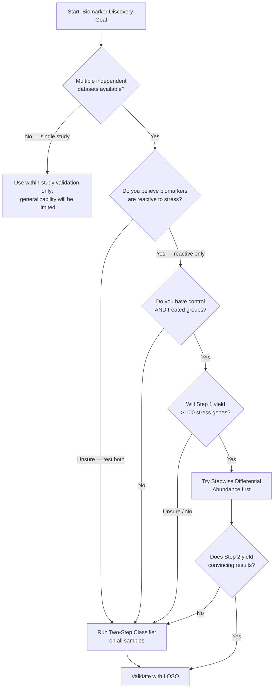

# Methods & Pipelines: Decision Guide

*Practical, decision-first guidance for implementing the analyses.*

This guide helps you choose the right analysis approach for your data. It also documents the two validated pipelines developed in this project and the validation strategies used to confirm results.

---

## Which Pipeline Should You Use?

**When in doubt:** Use the [Two-Step Classifier](classifier-path.md). It is the primary validated approach in this project, does not require control groups, and preserves both innate and reactive biomarkers.

**Use [Stepwise Differential Abundance](stepwise.md) only if** you have a strong prior belief that biomarkers are reactive (not innate), and you have sufficient stress-responsive genes (> 100) surviving Step 1.

---

## Pipeline Overview

| | Stepwise Differential Abundance | Two-Step Classifier |
|---|---|---|
| **Status** | ⚠️ Partially validated | ✅ Validated (6-gene panel) |
| **Requires control groups** | Yes | No |
| **Captures innate biomarkers** | ❌ No | ✅ Yes |
| **Handles small gene sets** | ❌ VST breaks down | ✅ Logistic regression works |
| **Best for** | Reactive biomarkers, large gene sets | Any dataset design |
| **Cross-study validation** | LOSO | LOSO |

---

## Pipeline Details

- **[4b. Stepwise Differential Abundance](stepwise.md)** — Two-step filtering: control vs. treated → resistant vs. sensitive
- **[4c. Two-Step Classifier](classifier-path.md)** — Reproducibility scoring → logistic regression; primary validated approach
- **[4d. Validation & Pitfalls](validation.md)** — Avoiding overfitting, LOSO protocol, batch effects

---

**Next:** Start with the [Two-Step Classifier](classifier-path.md) if you're implementing a new analysis, or read [Validation & Pitfalls](validation.md) to understand cross-study validation requirements.
