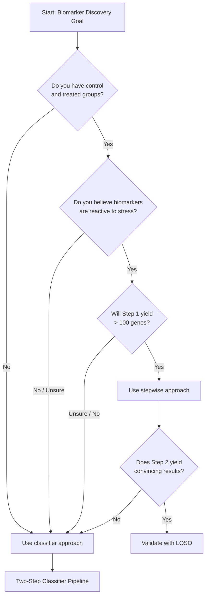

# Pipeline: Stepwise Differential Abundance

## Overview

The stepwise differential abundance approach attempts to identify resilience biomarkers by filtering genes in two sequential steps:

1. **Step 1:** Identify stress-responsive genes (control vs. treated)
2. **Step 2:** Identify resistance-associated genes (from Step 1 genes, compare resistant vs. sensitive)

**Status:** ⚠️ **Partially validated** - works in some contexts but has critical limitations

## When to Use This Approach

✅ **Use when:**

- You want to identify genes that are both stress-responsive AND differentiate phenotypes
- You have clear control and treatment groups within studies
- Your biological hypothesis is that biomarkers are reactive (induced by stress)

❌ **Don't use when:**

- You suspect innate biomarkers (constitutively different between resistant/sensitive)
- You have very small gene sets (< 100 genes) after filtering
- Study design doesn't include both controls and treated samples

## The Pipeline

### Prerequisites

- Per-dataset gene count matrices
- Metadata with phenotype and treatment labels
- Reference genome/transcriptome annotation

### Step 1: Identify Stress-Responsive Genes

**Goal:** Find genes differentially expressed between control and treated samples (regardless of phenotype)

**Method:** Use DESeq2 or similar differential expression tool

```r
# Pseudocode example
dds <- DESeqDataSetFromMatrix(
  countData = counts,
  colData = metadata,
  design = ~ treatment  # control vs. treated
)
dds <- DESeq(dds)
results_step1 <- results(dds, alpha = 0.05)

# Filter for significant genes
stress_responsive <- results_step1[results_step1$padj < 0.05, ]
```

**Output:** List of stress-responsive genes (typically 50-5000 genes depending on study and threshold)

### Step 2: Identify Resistance-Associated Genes

**Goal:** From Step 1 genes, find those that differentiate resistant from sensitive phenotypes

**Method:** Subset counts to Step 1 genes, then run differential expression between phenotypes

```r
# Subset to stress-responsive genes only
counts_filtered <- counts[rownames(counts) %in% rownames(stress_responsive), ]

# Compare resistant vs. sensitive on filtered genes
dds2 <- DESeqDataSetFromMatrix(
  countData = counts_filtered,
  colData = metadata,
  design = ~ phenotype  # resistant vs. sensitive
)
dds2 <- DESeq(dds2)
results_step2 <- results(dds2, alpha = 0.05)
```

**Output:** Candidate resilience biomarkers

## Implementation Example: Dataset 1

From [Issue #41](https://github.com/Resilience-Biomarkers-for-Aquaculture/Cvirg_Pmarinus_RNAseq/issues/41) and [notebook post](https://resilience-biomarkers-for-aquaculture.github.io/SW-diffabund_stepwise_ds1/):

**Results:**

- Step 1 produced ~50 stress-responsive genes
- Step 2 identified only **1 significant gene**

**Analysis in:** [`analyses/stepwise_differentialabundance/`](https://github.com/Resilience-Biomarkers-for-Aquaculture/Cvirg_Pmarinus_RNAseq/tree/main/analyses/stepwise_differentialabundance)

## Critical Limitations

### 1. DESeq2 Breaks Down with Small Gene Sets

!!! danger "Small Gene Set Problem"
    When Step 1 produces < 100 genes, DESeq2's variance stabilizing transformation (VST) becomes unreliable. With only ~50 genes:
    
    - Not enough data for robust dispersion estimation
    - VST assumes thousands of genes for stable transformation
    - Results may be spurious

**Observed:** DESeq2 on 50 genes produced weak/unconvincing results

### 2. Removes Innate Biomarkers

!!! failure "Big Lesson #3: Filtering Out Innate Signals"
    Biomarkers may exist in control groups if they represent innate resilience (genes constitutively different in resistant vs. sensitive individuals, even before stress).
    
    **The stepwise approach removes these by design** because Step 1 filters for differential expression between control/treated.
    
    If a gene is expressed at different baseline levels in resistant vs. sensitive oysters but doesn't change with stress, it will be filtered out in Step 1.

See [Issue #53](https://github.com/Resilience-Biomarkers-for-Aquaculture/Cvirg_Pmarinus_RNAseq/issues/53) and [innate gene expression analysis](https://resilience-biomarkers-for-aquaculture.github.io/SY-innate-gene-expression/)

### 3. Study-Specific Effects Still Dominate

Even with stepwise filtering:

- Batch effects persist
- Per-dataset analysis required (not cross-study integration)
- Results may not generalize to other studies

## Decision Tree: Should You Use This Pipeline?



## Alternative: Two-Step Classifier

If the stepwise approach doesn't work for your data, consider the [Two-Step Classifier](classifier-path.md), which:

- Doesn't filter out innate biomarkers
- Handles any dataset design (doesn't require controls)
- Uses reproducibility scoring instead of sequential filtering
- Produced the validated 6-gene panel in this project

## Validation Requirements

If you proceed with stepwise approach:

1. **Within-study validation:** Can the genes predict phenotypes in held-out samples from the same study?
2. **Cross-study validation:** Use Leave-One-Study-Out (LOSO) - see [Validation & Pitfalls](validation.md)
3. **Biological validation:** Are genes functionally related to stress response pathways?

## Related Resources

- [Issue #41: Stepwise approach](https://github.com/Resilience-Biomarkers-for-Aquaculture/Cvirg_Pmarinus_RNAseq/issues/41)
- [Notebook: Stepwise on dataset 1](https://resilience-biomarkers-for-aquaculture.github.io/SW-diffabund_stepwise_ds1/)
- [Issue #53: Innate vs. reactive](https://github.com/Resilience-Biomarkers-for-Aquaculture/Cvirg_Pmarinus_RNAseq/issues/53)
- [nf-core/differentialabundance docs](https://nf-co.re/differentialabundance)

---

**Next:** See the more successful [Two-Step Classifier](classifier-path.md) approach, or learn about [Validation & Pitfalls](validation.md)
